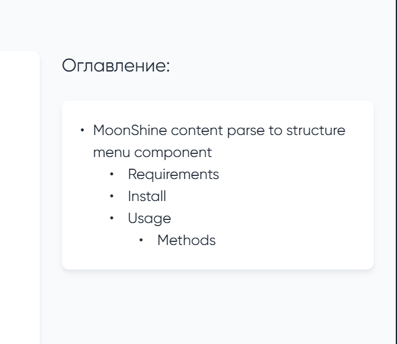

# MoonShine content parse to structure menu component


<picture>
  <source media="(prefers-color-scheme: dark)" srcset="./art/image.png">
  <source media="(prefers-color-scheme: light)" srcset="./art/image.png">
  
</picture>

Компонент парсит переданное в него содержимое на предмет заголовков разного уровня (h1-h6).
Модифицирует контент таким образом чтобы все заголовки имени идентификатор.
Строит из них иерархическую структуру и формирует из этой структуры меню с якорными ссылками на обновленный контент.

## Requirements

- MoonShine v3+
- Laravel v10+
- PHP v8.2+


## Install

```shell
composer require ermakk/ms-cs-component
```
Добавьте провайдер в ваш `config/app.php` 

```php

'providers' => ServiceProvider::defaultProviders()->merge([

//...

        \Ermakk\CSComponent\Providers\CSComponentServiceProvider::class
        
//...

])->toArray(),

```

## Usage

Для вывода оглавления используется компонент Menu.
Для инициализации обязателен один параметр - content
В качестве контента в меню передается класс реализующий интерфейс ContentContract
Задача этого класса - преобразование содержимого из необходимой вам разметки в HTML
для дальнейшего парсинга заголовков.

Вы можете создавать свои классы контента для вашей разметки, либо использовать существующие:
- `\Ermakk\CSComponent\Converters\MarkdownConverter` 
(Преобразует markdown разметку в html для дальнейшей работы парсера)
- `\Ermakk\CSComponent\Converters\Html` 
(не конвертирует контент, но даже если у вас контент был в html разметке - 
необходимо передавать его в меню именно через класс)

В качестве второго аргумента можно передать класс парсера, для того чтобы переопределить поведение,
разметку, правила генерации идентификаторов и т. п.

По умолчанию используется `Ermakk\CSComponent\Parsers\HTMLParser`

```php
use Ermakk\CSComponent\Components\StructureMenu\Menu;
use \Ermakk\CSComponent\Converters\MarkdownConverter;

Menu::make(MarkdownConverter::make($content))
```

По умолчанию все якорные ссылки генерируются исходя из текущей, но могут появиться ситуации,
когда будет необходимость вручную задать базу для ссылки. Для этого можно воспользоваться методом
`setRoute(?Closure $route)` у объекта Menu


```php
use Ermakk\CSComponent\Components\StructureMenu\Menu;
use \Ermakk\CSComponent\Converters\MarkdownConverter;

// в таком случае все что вернет замыкание, будет использовано в качестве якорной ссылки
// обратите внимание, что в таком случае вам нужно будет вручную добавить '#'.$item->id()
// к возвращаемому замыканием значению

Menu::make(MarkdownConverter::make($content))->setRoute(fn(StructureItem $item) => 'Ваш роут'.'#'.$item->id());
```

Последнее, что осталось сделать для полноценной работы - заменить контент на обновленный,
чтобы у всех заголовков появились идентификаторы.

Для этого можно компонент не сразу встраивать в методы формирующие страницу moonshine,
а объявить в классе страницы переменную и в нее при формировании страницы поместить наше меню.
А затем с помощью метода getParser() получить объект парсера и от него уже можно будет вернуть обновленную разметку

```php

    Str::markdown($this->structureMenu->getParser()->getNewHtml()),

```

В таком случае вы можете повторно использовать компонент Menu без повторного парсинга

Второй метод, для возврата обновленной разметки - это использовать метод getNewHtml() прямо от объекта Menu

```php

//...
   Menu(MarkdownConverter::make($resource->getItem()->content))
    ->getNewHtml($this->newContent)
    ->setTitle('Оглавление')
//...
```
в метод getNewHtml необходимо передать переменную, куда будет помещено новое значение 


### Methods
 - setTitle(string $title) - устанавливает заголовок меню

 - setPlaceholder(string $placeholder) - устанавливает сообщение, которое отображается, когда нет содержимого

 - simpleMode(bool $condition) - меняет режим отображения
   - true - простой режим, отображает только набор пунктов
   - false - стандартный режим, используемый по умолчанию, отображает заголовок меню и пункты в контейнере .box
 - getNewHtml() - принимает в качестве параметра переменную, куда по ссылке помещает обновленную разметку
 - так как Menu наследует MoonShineComponent, то будут доступны любые другие доступные для родительского класса методы